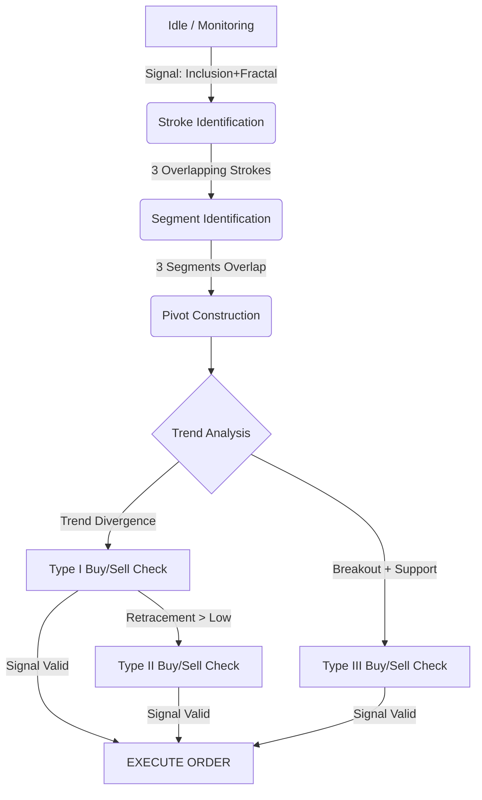

# Chan Theory: Algorithmic Trading Specification for AI Agents

> **Context**: This document reformulates the "Chan Lun" (Entangled Theory) into a structured, algorithmic specification designed for AI trading agents. It focuses on geometric quantification, recursive structure definition, and strict conditional logic for signal generation.

## 1. Data Structures & Primitive Definitions

### 1.1 K-Line Unit (Bar)
A fundamental time-series unit containing OHLC (Open, High, Low, Close) data.
*   **Struct**: `{ high: float, low: float, start_time: timestamp, end_time: timestamp }`

### 1.2 Standardization (K-Line Inclusion Processing)
To eliminate noise, K-lines must be pre-processed before identifying fractals.
*   **Inclusion Condition**: `(K2.high <= K1.high AND K2.low >= K1.low) OR (K2.high >= K1.high AND K2.low <= K1.low)`
*   **Processing Logic (Algorithm)**:
    ```python
    def standard_k_lines(bars):
        direction = UP  # Default or determined by previous context
        merged_bars = []
        for current_bar in bars:
            if inclusion_relation(prev_bar, current_bar):
                if direction == UP:
                    new_high = max(prev_bar.high, current_bar.high)
                    new_low = max(prev_bar.low, current_bar.low) # High-High, High-Low
                else: # direction == DOWN
                    new_high = min(prev_bar.high, current_bar.high)
                    new_low = min(prev_bar.low, current_bar.low) # Low-High, Low-Low
                update_prev_bar(new_high, new_low)
            else:
                merged_bars.append(current_bar)
                # Update direction based on new bar vs prev bar relation
    ```

### 1.3 Fractals (Vertex Identification)
The atomic geometric features used to define price turning points.
*   **Top Fractal (Ding Fen Xing)**: Sequence `[K1, K2, K3]` where `K2.high` is strictly max and `K2.low` is strictly max.
*   **Bottom Fractal (Di Fen Xing)**: Sequence `[K1, K2, K3]` where `K2.low` is strictly min and `K2.high` is strictly min.
*   **Constraint**: No inclusion relationships exist between K1, K2, K3 (processed in step 1.2).

## 2. Geometric Components (Morphology)

### 2.1 Stroke (Bi)
The minimal directional movement unit.
*   **Components**: `Bottom Fractal` -> `Rising K-lines` -> `Top Fractal` (Rising Stroke) or vice versa.
*   **Validity Constraints**:
    1.  **Atomicity**: Minimum 5 standardized K-lines between the apex of Top and Bottom fractals (inclusive).
    2.  **Direction**: For a Rising Stroke, `Top.high > Bottom.high` and `Top.low > Bottom.low`.
    3.  **Non-sharing**: Fractals cannot share K-lines in a minimal configuration.

### 2.2 Line Segment (Duan)
A higher-order movement composed of Strokes.
*   **Definition**: Formed by at least 3 consecutive Strokes with overlapping price intervals.
*   **Termination (Feature Sequence)**:
    *   Treat Strokes as elements in a sequence.
    *   Apply **Standardization** (1.2) to these Stroke elements.
    *   A Segment ends when a Fractal appears in the Stroke Feature Sequence.
    *   *Logic*: "A Line Segment is destroyed if and only if a new Line Segment is formed."

### 2.3 Central Pivot (Zhong Shu)
The core anchor for defining Trend Levels and Bull/Bear status.
*   **Definition**: The overlapping price range of at least three consecutive sub-level movements (Segments).
*   **Calculation**:
    *   Given three consecutive segments: `S1 (Up)`, `S2 (Down)`, `S3 (Up)`.
    *   `Pivot_High (ZG)` = `Min(S1.high, S2.high, S3.high)`
    *   `Pivot_Low (ZD)` = `Max(S1.low, S2.low, S3.low)`
    *   `Pivot_Range` = `[ZD, ZG]`
*   **Trend Definition**:
    *   **Consolidation (Pan Zheng)**: Contains exactly 1 Central Pivot.
    *   **Trend (Qu Shi)**: Contains >= 2 Central Pivots moving in the same direction with no overlap between pivots.

## 3. Dynamics & Evaluation Logic

### 3.1 Divergence (Bei Chi)
Used to identify Trend Exhaustion.
*   **Formula**: `Momentum(Current_Segment) < Momentum(Previous_Segment_Entering_Pivot)`
*   **Metrics**:
    *   **MACD Integration**: Sum of MACD Histogram bars within the segment duration.
    *   **Slope**: `(Price_End - Price_Start) / Time_Duration`.
*   **Types**:
    *   **Trend Divergence**: Occurs after at least 2 Central Pivots. High confidence reversal signal.
    *   **Consolidation Divergence**: Occurs within a Pivot oscillation. Lower confidence, used for intra-pivot scalping.

### 3.2 Interval Set (Recursive Drilling)
*   **Logic**: If `Level_N` shows Divergence, verify `Level_N-1` (Sub-level).
*   **Execution**:
    1.  Detect Potential Divergence on Daily Chart.
    2.  Zoom to 30m Chart: Is the final segment also diverging?
    3.  Zoom to 5m Chart: Is the final stroke diverging?
    4.  **Trigger**: When the smallest recursive level confirms divergence.

## 4. Signal Generation (The Three Buy/Sell Points)

Strict conditional triggers for the Agent. Assumes a Bullish setup (reverse for Bearish).

### 4.1 Type I Buy Point (Trend Reversal)
*   **Context**: Downward Trend (2+ Down Pivots).
*   **Condition**:
    1.  Price creates a new Low (below last Pivot ZD).
    2.  **Divergence Confirmed**: Current Down-Segment momentum < Previous Down-Segment momentum.
    3.  **Interval Set**: Sub-level structure confirms exhaustion.
*   **Action**: `OPEN LONG` (Aggressive).

### 4.2 Type II Buy Point (Confirmation)
*   **Context**: After Type I Buy Point.
*   **Condition**:
    1.  Price rallies (First Up-Stroke/Segment) and then retraces (First Down-Stroke/Segment).
    2.  **Non-New-Low**: Retracement Low > Type I Buy Point Low.
*   **Action**: `ADD POSITION` or `OPEN LONG` (Conservative).

### 4.3 Type III Buy Point (Breakout & Support)
*   **Context**: Upward movement or Breakout from Consolidation.
*   **Sequence**:
    1.  **Breakout**: Price moves entirely above Pivot High (`ZG`).
    2.  **Pullback**: Price retraces towards Pivot.
    3.  **Support**: Retracement Low > Pivot High (`ZG`).
*   **Logic**: The Pivot (Resistance) has successfully flipped to Support. The Trend is accelerating.
*   **Action**: `MAX LONG` (Trend Following).

## 5. State Machine for Trading Agents

The agent should maintain a state machine for each monitored symbol.



## 6. Intermediate Stage (Zhong Yin)
*   **Definition**: The uncertainty state after a Trend ends but before a new Trend is confirmed.
*   **Agent Policy**:
    *   Treat as **Pivot Oscillation** (Range Trading).
    *   Do not presume direction until a Type III Buy/Sell point appears or a Type I point validates a larger reversal.
    *   **Risk Control**: Tighten stops or reduce position size during Zhong Yin phases.

## 7. Implementation Checklist
1.  [ ] **Data Preprocessor**: Implement `Standardization` and `Fractal` detection.
2.  [ ] **Geometry Engine**: Implement `Stroke`, `Segment`, and `Pivot` parsers.
3.  [ ] **Momentum Indicator**: Implement `MACD Area` calculation linked to Geometry segments.
4.  [ ] **Signal Scanner**: Run loop checking 4.1, 4.2, and 4.3 conditions on real-time data.
5.  [ ] **Multi-Level Correlator**: Ensure signals align across at least two timeframes (e.g., 5m entry aligned with 30m setup).
